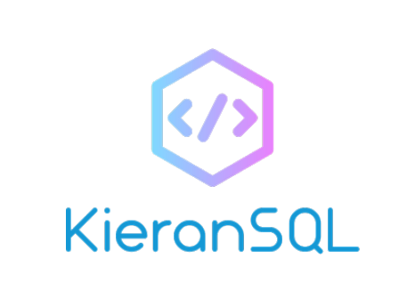

<div id="top"></div>


<br/>
<div align="center">
  <a href="https://github.com/OneBigUnit/KieranSQL">
    
  </a>

  <p align="center">
    A shallow wrapper around the inbuilt SQLite3 module, to abstract away all SQL, aiming for a consistent, simple, pythonic syntax.
    <br />
    <br />
    <a href="https://github.com/OneBigUnit/KieranSQL/blob/b889a6dc2d85f6368f01c284fd52f7bc981edbb9/Docs/Documentation.md"><strong>Explore the Docs »</strong></a>
    <br />
    <br />
  </p>
</div>

<details>
  <summary>Table of Contents</summary>
  <ol>
    <li><a href="#getting-started">Getting Started</a></li>
      <ul>
        <li><a href="#replit">Replit</a></li>
      </ul>
    <li><a href="#usage-examples">Usage Examples</a></li>
      <ul>
        <li><a href="#creating-a-table">Creating a Table</a></li>
        <li><a href="#linking-tables">Linking Tables</a></li>
        <li><a href="#manipulating-tables">Manipulating Tables</a></li>
        <li><a href="#using-optional-settings">Using Optional Settings</a></li>
        <li><a href="#using-less-common-data-types">Using Less Common Data Types</a></li>
      </ul>
    <li><a href="#features">Features</a></li>
      <ul>
        <li><a href="#support-for-all-common-data-types">Data Type Support</a></li>
        <li><a href="#support-for-all-common-sql-statements">SQL Statement Support</a></li>
        <li><a href="#field-restraint-support">Field Restraint Support</a></li>
        <li><a href="#data-safety">Data Safety</a></li>
        <li><a href="#data-normalization-support">Data Normalization Support</a></li>
        <li><a href="#other-features">Other Features</a></li>
      </ul>
    <li><a href="#coding-techniques-i-used">Coding Techniques Used / Challenges Faced</a></li>
      <ul>
        <li><a href="#class-decorators">Class Decorators</a></li>
        <li><a href="#metaclasses">Metaclasses</a></li>
        <li><a href="#column-boolean-logic">Abstract Boolean Logic</a></li>
        <li><a href="#the-select-and-where-statements">SELECT and WHERE Statement Wrappers</a></li>
        <li><a href="#building-a-string-representation-of-a-selection">String Representation of a Table</a></li>
        <li><a href="#context-managers">Context Managers</a></li>
        <li><a href="#type-wrappers">Type Wrappers</a></li>
      </ul>
    <li><a href="#license">License</a></li>
  </ol>
</details>


## Getting Started

To run this code, follow the below instructions:
* Head over to the [KieranSQL Replit](https://replit.com/@KieranLock/KieranSQL)
* Click run!


### Replit

1. Once you are viewing the project on [Replit.com](https://replit.com), you can edit any code you like
2. All source code can be found in the `KieranSQL` directory
3. For examples on how to use this module, see [Usage Examples](#usage-examples)

<p align="right">(<a href="#top">back to top</a>)</p>


## Usage Examples

Below are some examples of how to use `KieranSQL`.

### Creating a table

Below is how to create a simple SQLite table using KieranSQL:
```
from KieranSQL import SQLiteTable, String, Integer

@SQLiteTable()
class People:
  PersonID: Integer(primary_key=True)
  FirstName: String(30)
  LastName: String(20)
  Nationality: String(20)
```

### Linking tables

Below is how to link two tables using a **foreign key**:
```
from KieranSQL import SQLiteTable, String, Integer

@SQLiteTable()
class Nationalities:
  ID: Integer(primary_key=True)
  Name: String(20)

@SQLiteTable()
class People:
  PersonID: Integer(primary_key=True)
  FirstName: String(30)
  LastName: String(20)
  Nationality: Nationalities.ID  # This column declaration refers to the other created table, linking them
```

### Manipulating Tables

Below is how to send all supported SQL statements to a table:
```
from KieranSQL import SQLiteTable, String, Integer, connect_to

@SQLiteTable()
class People:
  PersonID: Integer(primary_key=True)
  FirstName: String(30)
  LastName: String(20)

with connect_to(People, commit=True):
  People.InsertInto({
    People.FirstName: "Person", 
    People.LastName: "One"
  })
  
  People.InsertInto({
    People.FirstName: "Person", 
    People.LastName: "Two"
  })
 
  People.Update({
    People.FirstName: "Child"
  }).Where(
    People.LastName == "One"
  )
  
  People.Delete().Where(
    People.LastName == "Two"
  )
  
  fetched_data = People.Select("*").Where(
    People.FirstName == "Child"
  ).Fetch()

print(fetched_data)
```

### Using Optional Settings

Below is how to enable optional settings, using **Key Word Arguments**:
```
from KieranSQL import SQLiteTable, String, Integer, connect_to

@SQLiteTable(path="WhereverIWant.db")  # path= specifies which database to store the table ==> Defaults to "database.db"
class People:
  PersonID: Integer(primary_key=True)  # Every table must contain exactly one primary key, indicated by the primary_key= argument
  FirstName: String(30, nullable=False)  # nullable= Ensures that a column cannot store 'NULL' fields
  LastName: String(20)

with connect_to(People, commit=True, output_queries=True):  # output_queries= specifies whether to print every SQL that is constructed and executed to the console or not
  People.InsertInto({                                       # commit= can also be disabled, which does not save changes to the database after the 'with' block
    People.FirstName: "Person", 
    People.LastName: "One"
  })
```

### Using Less Common Data Types

Below shows how to use the data types `Date` and `Time` in a table:
```
from KieranSQL import SQLiteTable, String, Integer, Date, Time, connect_to
from datetime import date, time  # The 'Date' and 'Time' types convert to and from these types from the python standard library,
                                 # so more features can be used. A String can be used instead if this is not preferable

@SQLiteTable(path="WhereverIWant.db")
class People:
  PersonID: Integer(primary_key=True)
  FirstName: String(30)
  LastName: String(20)
  BirthDate: Date()
  BedTime: Time()

with connect_to(People, commit=True):
  People.InsertInto({
    People.FirstName: "Person", 
    People.LastName: "One",
    People.BirthDate: date(2002, 6, 29),
    People.BedTime: time(22, 30)
  })
  
  fetched_data = People.Select("*").Fetch()

print(fetched_data)  # Prints the single-record table. BirthDate and BedTime can be retrieved from 'fetched_data' as their original types
```

_For referencing further examples and specific syntax, see the [Documentation](https://github.com/OneBigUnit/KieranSQL/blob/b889a6dc2d85f6368f01c284fd52f7bc981edbb9/Docs/Documentation.md)_

<p align="right">(<a href="#top">back to top</a>)</p>


## Features

Below is a list of all the features provided in the `KieranSQL` module.

### Support for all common data types

`KieranSQL` has support for most common SQL data types, including:
* Strings
* Integers
* Decimals
* Booleans
* NULL
* Dates
* Times

### Support for all common SQL statements

`KieranSQL` has support for most common SQL statements, including:
* SELECT
* INSERT INTO
* UPDATE
* DELETE
* WHERE

### Field Restraint Support

Columns can be declared with certain restraints, such as:
* Primary Key
* Foreign Key
* Non-Nullable

### Data Safety

`KieranSQL` also attempts to keep your stored data as safe as possible, with the following features:
* Parameterised Queries (SQL Injection Protection)
* Optional Commits (Default Off)
* Optional SQL Query Output (Default Off)

### Data Normalization Support

Tables can also be arranged into the 1st, 2nd, and 3rd Normal Forms, for data organization.
This is largely due to `KieranSQL`'s support for foreign keys, which can link multiple tables together within a database.

<br>

[Find information on Data Normalization here!](https://www.relationaldbdesign.com/database-analysis/module4/first-second-third-normal-forms.php)

### Other Features

`KieranSQL` also packs in other features, such as the following:
* Table Viewing
* Optional SQL Query Output
* Safe from SQL Injection
* Fully Documented and Type-Hinted Source Code, and available documentation

_Any further information and details reagrding `KieranSQL` features can be found in the [Documentation](https://github.com/OneBigUnit/KieranSQL/blob/b889a6dc2d85f6368f01c284fd52f7bc981edbb9/Docs/Documentation.md)_

<p align="right">(<a href="#top">back to top</a>)</p>


## Coding Techniques I Used / Challenges I Faced

Below is a more detailed look at the source code of the project - specifically the more complicated code behind `KieranSQL`.

### Class Decorators

The `@SQLiteTable()` syntax used for creating any tables with `KieranSQL` is a class decorator, which returns an extended class, which inherits from the `Table` class.
Standard Inheritance could not be used here, as that would force the user to have to call the `Table` class' methods - using a class decorator, this can be abstracted away.

### Metaclasses

The metaclass `TableTemplate` was required to overwrite how a Table itself is printed to the console. No other method could be used, as due to the `Table` class' static nature, it was the class itself that needed its `__str__` method overwritten, requiring a metaclass

### Column Boolean Logic

Within `WHERE` statements, boolean logic is required between `ColumnWrapper` classes themselves, without knowing the data in those columns. This was solved by overwriting all of `ColumnWrapper`'s boolean _'magic methods'_, which each return a `WhereConditionWrapper` object, which encapsulates the SQL statement conversion. This boolean logic can then be chained together (using python's `&` or `\` operators), as `WhereConditionWrapper` has the functionality to chain itself with other objects of the same type.

### The Select and Where Statements

My initial approach to creating the `SELECT` statement was naive, by default selecting all data from the table in question, and then filtering the selected data, using a `WHERE` statement. However, this was incredibly inefficient - therefore, I had to build queries of unknown composition, and execute them after all statement components had been added. To do this, every 'base statement' had to inherit from `SQLStatement`, which contained the `WHERE` statement wrapper.

### Building a String Representation of a Selection

To achieve this, I used even tabbing to give each column equal padding. Not only did this require some confusing maths, but I also had to rotate a matrix 270 degrees, in order to find the longest field in each column, and determine the amount of padding per field using that data.

### Context Managers

Unfortunately, there was no way to create a database connection context manager as a part of the `Table` class, due to context manager and static method compatability together. However, this approach abstracts database connections and cursors away from the user entirely, and gives access to the customization of settings, which can change throughout a program.

### Type Wrappers

Lastly was the implementation of SQL type wrappers. Columns had to be built from type-hint syntax, and every Python data type (that stores data atomically) needed some way to convert to SQL types when Inserting Data, and back to Python types when Fetching - this got particularly confusing with `NULL` types, and nullable columns. Every type wrapper used polymorphism in such a way that each could be treated the same in other areas of code, but individually, execute differently.


## Further Information

Here you can find any relevant additional information

### Other Documentation

* Take a look at the SQLite3 Docs [here]()
* Find the Python Docs [here]()

### Credit

* [RelationalDBDesign.com](https://www.relationaldbdesign.com)
* [Replit.com](https://replit.com)


## License

Distributed under the MIT License. See `LICENSE.txt` for more information.

<p align="right">(<a href="#top">back to top</a>)</p>
